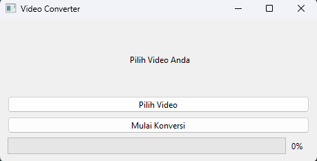

# Video to Image Converter
This program is a Video to Image Converter built using PyQt6 and OpenCV. It allows users to select a video file (in formats like MP4, AVI, or MOV), and the program will convert the video into individual frames (images). These images are saved as PNG files, one for each frame at regular intervals.

The application includes:
- A file selection dialog to choose the video.
- A progress bar to show the conversion process.
- Status updates to inform the user about the process (such as which video is selected and when the conversion is complete).

## Tools Used
- Python: The programming language used to write the application.
- PyQt6: A GUI toolkit for Python that provides the framework for creating the graphical user interface (GUI).
- OpenCV: A powerful open-source library for computer vision, used in this program to read video files and extract frames.
- QFileDialog: A class from PyQt6 used to create file dialog windows for selecting files on the system.
- Progress Bar: A widget from PyQt6 that shows the progress of the video-to-image conversion.

## Design Creation
1. Make sure PyQt6 is installed: pip install pyqt6-tools
2. Open Qt Designer : pyqt6_tools designer
3. Add GUI components 
4. Save the file: make sure ".ui"
5. Find where the file is located: /s /b "file name".ui
6. Enter the file location 
7. Convert To python : "File location" -o "filename".py
8. Check in file explorer: make sure the file is ".py"
9. Open VS Code

## Screenshot

## Instruction
1. Click "Pilih Video" to choose a video file (e.g., MP4, AVI, MOV).
2. Click "Mulai Konversi" to start converting the video into images.
3. The frames from the video will be saved as PNG files in the same folder where the program is located.
4. Watch the progress bar fill as the conversion progresses.
5. After the conversion is complete, a message will appear saying "Konversi selesai!" (Conversion complete!).
6. Check the program's folder for the resulting image files, named frame_0.png, frame_1.png, frame_2.png, etc.

## Credits
- LTI Team
- QT
- ffmpeg-python
- ChatGPT