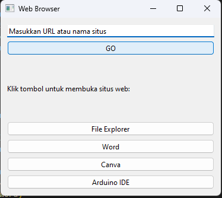

# Web Browser with Access to Multiple Applications
This program is a GUI-based application developed using PyQt6, which allows users to easily open various applications and websites. Users can enter a website URL and click a button to open it in the default browser. Additionally, this application provides direct access to other applications installed on the computer, such as File Explorer, Microsoft Word, Canva, and Arduino IDE. This program is especially useful for users who frequently switch between different applications and websites without having to open each application individually.

## Tools Used
- PyQt6: Used to create the graphical user interface (GUI) that allows interaction with the application.
- Python: The programming language used to run the program's logic.
- Subprocess: Used to launch external applications like File Explorer, Word, Canva, and Arduino IDE.
- Webbrowser: Used to open the URL entered by the user in the default web browser.

## Design Creation
1. Make sure PyQt6 is installed: pip install pyqt6-tools
2. Open Qt Designer : pyqt6_tools designer
3. Add GUI components 
4. Save the file: make sure ".ui"
5. Find where the file is located: /s /b "file name".ui
6. Enter the file location 
7. Convert To python : "File location" -o "filename".py
8. Check in file explorer: make sure the file is ".py"
9. Open VS Code

## Screenshot

## Instruction
1. Enter URL : In the input box, enter the URL of the website you want to visit, such as https://www.google.com.
Click the GO button to open the URL in your default web browser.
2. Open File Explorer : Click the File Explorer button to open the File Explorer on your operating system.
3. Open Microsoft Word : Click the Word button to open the Microsoft Word application on your system.
4. Open Canva : Click the Canva button to open the Canva application (make sure Canva is installed on your computer).
5. Open Arduino IDE : Click the Arduino IDE button to open the Arduino IDE (ensure that Arduino IDE is installed on your computer).

## Credits
- LTI Team
- QT
- ffmpeg-python
- ChatGPT